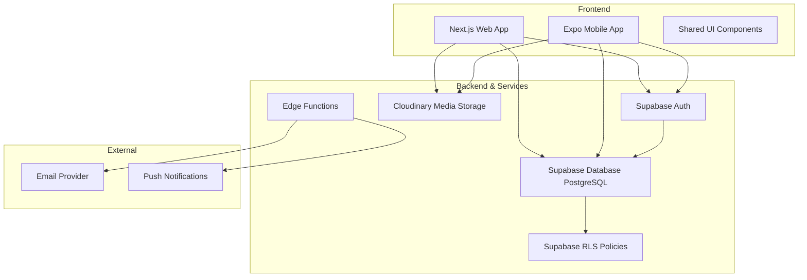
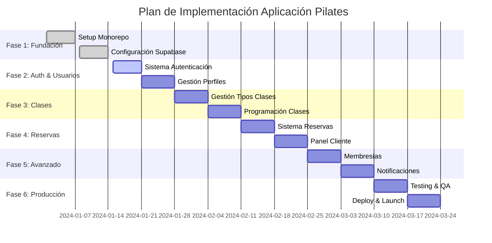

# Guía Técnica Completa: Aplicación de Gestión de Turnos Pilates Reformer

## Índice

1. [Arquitectura del Sistema](#1-arquitectura-del-sistema)
2. [Diseño de Base de Datos](#2-diseño-de-base-de-datos)
3. [Sistema de Autenticación y RBAC](#3-sistema-de-autenticación-y-rbac)
4. [Estructura del Proyecto](#4-estructura-del-proyecto)
5. [Funcionalidades por Rol](#5-funcionalidades-por-rol)
6. [Integración con Cloudinary](#6-integración-con-cloudinary)
7. [Código de Ejemplo](#7-código-de-ejemplo)
8. [Configuraciones Técnicas](#8-configuraciones-técnicas)
9. [Plan de Implementación](#9-plan-de-implementación)
10. [Despliegue y Mantenimiento](#10-despliegue-y-mantenimiento)

---

## 1. Arquitectura del Sistema

### 1.1 Visión General de la Arquitectura



### 1.2 Principios Arquitectónicos

**Separación de Responsabilidades**[1]:

- **Frontend**: Next.js para web y Expo para móvil con componentes compartidos
- **Backend**: Supabase como Backend-as-a-Service (BaaS)
- **Autenticación**: Supabase Auth con JWT y custom claims
- **Autorización**: Row Level Security (RLS) + Role-Based Access Control (RBAC)
- **Media**: Cloudinary para gestión optimizada de imágenes

**Patrones de Arquitectura Aplicados**[2]:

- **Server-First**: Priorizar Server Components para fetching de datos
- **Progressive Enhancement**: Funcionalidad base sin JavaScript + mejoras progresivas
- **Offline-First**: Capacidades offline básicas con sincronización
- **Security by Design**: Seguridad implementada desde el diseño (RLS, RBAC)

### 1.3 Stack Tecnológico

| Capa | Tecnología | Justificación |
|------|------------|---------------|
| **Frontend Web** | Next.js 15+ | SSR/SSG, App Router, Server Components[1] |
| **Frontend Mobile** | Expo 51+ | React Native con tooling mejorado |
| **Estructura Proyecto** | Monorepo (pnpm) | Código compartido, gestión unificada[1] |
| **Base de Datos** | Supabase (PostgreSQL) | BaaS, RLS nativo, real-time |
| **Autenticación** | Supabase Auth | JWT, OAuth, custom claims[5] |
| **Media Storage** | Cloudinary | Optimización automática, transformaciones[8] |
| **UI Framework** | Tailwind CSS | Utility-first, componentes compartidos |
| **Validación** | Zod | Type-safe validation, esquemas reutilizables[1] |
| **Testing** | Playwright | E2E testing sobre app construida[1] |

---

## 2. Diseño de Base de Datos

### 2.1 Esquema Principal

Basado en mejores prácticas para sistemas de gestión de citas[3]:

```sql
-- =============================================================================
-- ESQUEMA DE BASE DE DATOS PARA PILATES REFORMER STUDIO
-- =============================================================================

-- Extensiones necesarias
CREATE EXTENSION IF NOT EXISTS "uuid-ossp";

-- =============================================================================
-- TIPOS ENUMERADOS
-- =============================================================================

CREATE TYPE user_role AS ENUM ('admin', 'instructor', 'cliente');
CREATE TYPE clase_estado AS ENUM ('programada', 'en_progreso', 'completada', 'cancelada');
CREATE TYPE reserva_estado AS ENUM ('confirmada', 'en_espera', 'cancelada');
CREATE TYPE membership_tipo AS ENUM ('mensual', 'trimestral', 'anual', 'paquete_clases');

-- =============================================================================
-- TABLA DE PERFILES DE USUARIO
-- =============================================================================

CREATE TABLE public.profiles (
    id UUID REFERENCES auth.users(id) ON DELETE CASCADE PRIMARY KEY,
    created_at TIMESTAMPTZ DEFAULT NOW() NOT NULL,
    updated_at TIMESTAMPTZ DEFAULT NOW() NOT NULL,
    
    -- Información personal
    first_name VARCHAR(64) NOT NULL,
    last_name VARCHAR(64) NOT NULL,
    email VARCHAR(255) UNIQUE NOT NULL,
    phone VARCHAR(20),
    date_of_birth DATE,
    
    -- Información de contacto
    address TEXT,
    emergency_contact_name VARCHAR(128),
    emergency_contact_phone VARCHAR(20),
    
    -- Información médica/fitness
    health_conditions TEXT,
    fitness_level VARCHAR(20) DEFAULT 'principiante',
    goals TEXT,
    
    -- Preferencias
    preferred_language VARCHAR(5) DEFAULT 'es',
    timezone VARCHAR(50) DEFAULT 'America/Argentina/Buenos_Aires',
    notifications_enabled BOOLEAN DEFAULT true,
    
    -- Avatar
    avatar_url VARCHAR(500),
    
    -- Rol del usuario
    role user_role DEFAULT 'cliente',
    
    -- Estado del perfil
    is_active BOOLEAN DEFAULT true,
    
    -- Metadata
    metadata JSONB DEFAULT '{}'::jsonb
);

-- =============================================================================
-- TABLA DE INSTRUCTORES (extiende profiles)
-- =============================================================================

CREATE TABLE public.instructors (
    id UUID REFERENCES public.profiles(id) ON DELETE CASCADE PRIMARY KEY,
    created_at TIMESTAMPTZ DEFAULT NOW() NOT NULL,
    
    -- Información profesional
    certification_level VARCHAR(50) NOT NULL,
    certifications TEXT[], -- Array de certificaciones
    specializations TEXT[], -- Array de especializaciones
    experience_years INTEGER DEFAULT 0,
    
    -- Horarios y disponibilidad
    weekly_availability JSONB, -- Horarios por día de la semana
    hourly_rate DECIMAL(10,2),
    
    -- Bio y presentación
    bio TEXT,
    profile_image_url VARCHAR(500),
    
    -- Estado laboral
    hire_date DATE,
    is_active BOOLEAN DEFAULT true,
    
    -- Metadata adicional
    metadata JSONB DEFAULT '{}'::jsonb
);

-- =============================================================================
-- TABLA DE EQUIPOS/REFORMERS
-- =============================================================================

CREATE TABLE public.equipment (
    id UUID DEFAULT uuid_generate_v4() PRIMARY KEY,
    created_at TIMESTAMPTZ DEFAULT NOW() NOT NULL,
    updated_at TIMESTAMPTZ DEFAULT NOW() NOT NULL,
    
    -- Información del equipo
    name VARCHAR(100) NOT NULL, -- ej: "Reformer 1", "Reformer 2"
    type VARCHAR(50) DEFAULT 'reformer',
    brand VARCHAR(50),
    model VARCHAR(50),
    serial_number VARCHAR(100),
    
    -- Estado y ubicación
    location VARCHAR(100), -- Ubicación en el estudio
    is_available BOOLEAN DEFAULT true,
    maintenance_date DATE,
    next_maintenance_date DATE,
    
    -- Notas
    notes TEXT,
    
    -- Metadata
    metadata JSONB DEFAULT '{}'::jsonb
);

-- =============================================================================
-- TABLA DE TIPOS DE CLASES
-- =============================================================================

CREATE TABLE public.class_types (
    id UUID DEFAULT uuid_generate_v4() PRIMARY KEY,
    created_at TIMESTAMPTZ DEFAULT NOW() NOT NULL,
    updated_at TIMESTAMPTZ DEFAULT NOW() NOT NULL,
    
    -- Información básica
    name VARCHAR(100) NOT NULL, -- ej: "Pilates Principiante", "Pilates Avanzado"
    description TEXT,
    
    -- Configuración de la clase
    duration_minutes INTEGER NOT NULL DEFAULT 60,
    max_participants INTEGER NOT NULL DEFAULT 1, -- Para Reformer típicamente 1-a-1
    min_participants INTEGER DEFAULT 1,
    
    -- Nivel y requisitos
    difficulty_level VARCHAR(20) DEFAULT 'principiante',
    prerequisites TEXT,
    
    -- Precio
    price DECIMAL(10,2) NOT NULL,
    
    -- Configuración visual
    color_hex VARCHAR(7) DEFAULT '#3B82F6',
    icon VARCHAR(50),
    
    -- Estado
    is_active BOOLEAN DEFAULT true,
    
    -- Metadata
    metadata JSONB DEFAULT '{}'::jsonb
);

-- =============================================================================
-- TABLA DE CLASES PROGRAMADAS
-- =============================================================================

CREATE TABLE public.scheduled_classes (
    id UUID DEFAULT uuid_generate_v4() PRIMARY KEY,
    created_at TIMESTAMPTZ DEFAULT NOW() NOT NULL,
    updated_at TIMESTAMPTZ DEFAULT NOW() NOT NULL,
    
    -- Referencias
    class_type_id UUID REFERENCES public.class_types(id) NOT NULL,
    instructor_id UUID REFERENCES public.instructors(id) NOT NULL,
    equipment_id UUID REFERENCES public.equipment(id),
    
    -- Información temporal
    start_time TIMESTAMPTZ NOT NULL,
    end_time TIMESTAMPTZ NOT NULL,
    date DATE GENERATED ALWAYS AS (start_time::date) STORED,
    
    -- Estado de la clase
    status clase_estado DEFAULT 'programada',
    
    -- Capacidad
    max_participants INTEGER NOT NULL,
    current_participants INTEGER DEFAULT 0,
    
    -- Precios (pueden ser diferentes del tipo de clase)
    price DECIMAL(10,2) NOT NULL,
    
    -- Información adicional
    notes TEXT,
    is_recurring BOOLEAN DEFAULT false,
    recurring_pattern JSONB, -- Para clases recurrentes
    
    -- Cancelación
    cancelled_at TIMESTAMPTZ,
    cancellation_reason TEXT,
    
    -- Metadata
    metadata JSONB DEFAULT '{}'::jsonb
);

-- =============================================================================
-- TABLA DE RESERVAS
-- =============================================================================

CREATE TABLE public.bookings (
    id UUID DEFAULT uuid_generate_v4() PRIMARY KEY,
    created_at TIMESTAMPTZ DEFAULT NOW() NOT NULL,
    updated_at TIMESTAMPTZ DEFAULT NOW() NOT NULL,
    
    -- Referencias
    user_id UUID REFERENCES public.profiles(id) ON DELETE CASCADE NOT NULL,
    scheduled_class_id UUID REFERENCES public.scheduled_classes(id) NOT NULL,
    
    -- Estado de la reserva
    status reserva_estado DEFAULT 'confirmada',
    
    -- Información de pago
    amount_paid DECIMAL(10,2) NOT NULL,
    payment_method VARCHAR(50),
    payment_reference VARCHAR(100),
    paid_at TIMESTAMPTZ,
    
    -- Asistencia
    attended BOOLEAN,
    checked_in_at TIMESTAMPTZ,
    
    -- Cancelación
    cancelled_at TIMESTAMPTZ,
    cancellation_reason TEXT,
    refund_amount DECIMAL(10,2) DEFAULT 0,
    
    -- Notas
    user_notes TEXT,
    instructor_notes TEXT,
    
    -- Metadata
    metadata JSONB DEFAULT '{}'::jsonb,
    
    UNIQUE(user_id, scheduled_class_id)
);

-- =============================================================================
-- TABLA DE MEMBRESÍAS
-- =============================================================================

CREATE TABLE public.memberships (
    id UUID DEFAULT uuid_generate_v4() PRIMARY KEY,
    created_at TIMESTAMPTZ DEFAULT NOW() NOT NULL,
    updated_at TIMESTAMPTZ DEFAULT NOW() NOT NULL,
    
    -- Referencias
    user_id UUID REFERENCES public.profiles(id) ON DELETE CASCADE NOT NULL,
    
    -- Tipo de membresía
    type membership_tipo NOT NULL,
    
    -- Vigencia
    start_date DATE NOT NULL,
    end_date DATE NOT NULL,
    
    -- Clases incluidas (para tipo paquete_clases)
    total_classes INTEGER,
    used_classes INTEGER DEFAULT 0,
    remaining_classes INTEGER GENERATED ALWAYS AS (total_classes - used_classes) STORED,
    
    -- Información de pago
    amount_paid DECIMAL(10,2) NOT NULL,
    payment_method VARCHAR(50),
    payment_reference VARCHAR(100),
    
    -- Estado
    is_active BOOLEAN DEFAULT true,
    is_frozen BOOLEAN DEFAULT false,
    frozen_until DATE,
    
    -- Metadata
    metadata JSONB DEFAULT '{}'::jsonb
);

-- =============================================================================
-- TABLA DE LISTA DE ESPERA
-- =============================================================================

CREATE TABLE public.waiting_list (
    id UUID DEFAULT uuid_generate_v4() PRIMARY KEY,
    created_at TIMESTAMPTZ DEFAULT NOW() NOT NULL,
    
    -- Referencias
    user_id UUID REFERENCES public.profiles(id) ON DELETE CASCADE NOT NULL,
    scheduled_class_id UUID REFERENCES public.scheduled_classes(id) NOT NULL,
    
    -- Posición en lista
    position INTEGER NOT NULL,
    
    -- Estado
    is_active BOOLEAN DEFAULT true,
    notified BOOLEAN DEFAULT false,
    
    -- Expiración de la notificación
    notification_expires_at TIMESTAMPTZ,
    
    UNIQUE(user_id, scheduled_class_id)
);

-- =============================================================================
-- ÍNDICES PARA OPTIMIZACIÓN
-- =============================================================================

-- Índices para consultas frecuentes
CREATE INDEX idx_scheduled_classes_date ON public.scheduled_classes(date);
CREATE INDEX idx_scheduled_classes_instructor ON public.scheduled_classes(instructor_id);
CREATE INDEX idx_scheduled_classes_status ON public.scheduled_classes(status);
CREATE INDEX idx_bookings_user_date ON public.bookings(user_id, created_at);
CREATE INDEX idx_bookings_class_status ON public.bookings(scheduled_class_id, status);
CREATE INDEX idx_memberships_user_active ON public.memberships(user_id, is_active);

-- Índices para búsquedas de texto
CREATE INDEX idx_profiles_name ON public.profiles(first_name, last_name);
CREATE INDEX idx_class_types_name ON public.class_types(name);

-- =============================================================================
-- TRIGGERS PARA TIMESTAMPS AUTOMÁTICOS
-- =============================================================================

CREATE OR REPLACE FUNCTION update_updated_at_column()
RETURNS TRIGGER AS $$
BEGIN
    NEW.updated_at = NOW();
    RETURN NEW;
END;
$$ language 'plpgsql';

CREATE TRIGGER update_profiles_updated_at BEFORE UPDATE ON public.profiles
    FOR EACH ROW EXECUTE FUNCTION update_updated_at_column();

CREATE TRIGGER update_scheduled_classes_updated_at BEFORE UPDATE ON public.scheduled_classes
    FOR EACH ROW EXECUTE FUNCTION update_updated_at_column();

CREATE TRIGGER update_bookings_updated_at BEFORE UPDATE ON public.bookings
    FOR EACH ROW EXECUTE FUNCTION update_updated_at_column();

CREATE TRIGGER update_equipment_updated_at BEFORE UPDATE ON public.equipment
    FOR EACH ROW EXECUTE FUNCTION update_updated_at_column();

-- =============================================================================
-- FUNCIONES AUXILIARES
-- =============================================================================

-- Función para actualizar el contador de participantes
CREATE OR REPLACE FUNCTION update_class_participant_count()
RETURNS TRIGGER AS $$
BEGIN
    IF TG_OP = 'INSERT' AND NEW.status = 'confirmada' THEN
        UPDATE public.scheduled_classes 
        SET current_participants = current_participants + 1
        WHERE id = NEW.scheduled_class_id;
    ELSIF TG_OP = 'DELETE' AND OLD.status = 'confirmada' THEN
        UPDATE public.scheduled_classes 
        SET current_participants = current_participants - 1
        WHERE id = OLD.scheduled_class_id;
    ELSIF TG_OP = 'UPDATE' THEN
        IF OLD.status = 'confirmada' AND NEW.status != 'confirmada' THEN
            UPDATE public.scheduled_classes 
            SET current_participants = current_participants - 1
            WHERE id = NEW.scheduled_class_id;
        ELSIF OLD.status != 'confirmada' AND NEW.status = 'confirmada' THEN
            UPDATE public.scheduled_classes 
            SET current_participants = current_participants + 1
            WHERE id = NEW.scheduled_class_id;
        END IF;
    END IF;
    
    RETURN COALESCE(NEW, OLD);
END;
$$ LANGUAGE plpgsql;

CREATE TRIGGER trigger_update_participant_count
    AFTER INSERT OR UPDATE OR DELETE ON public.bookings
    FOR EACH ROW EXECUTE FUNCTION update_class_participant_count();
```

### 2.2 Justificación del Diseño

**Separación de Responsabilidades**[3]:

- **profiles**: Información base de todos los usuarios
- **instructors**: Extensión para datos específicos de instructores
- **equipment**: Gestión de reformers y equipos
- **class_types**: Tipos de clases como plantillas
- **scheduled_classes**: Instancias específicas de clases programadas
- **bookings**: Reservas individuales con tracking completo

**Flexibilidad para Diferentes Tipos de Clases**[9]:

- Clases individuales (1:1) típicas de Pilates Reformer
- Clases grupales pequeñas
- Clases virtuales (metadata específico)
- Diferentes duraciones y precios

**Gestión de Capacidad y Lista de Espera**[3]:

- Control automático de cupos disponibles
- Sistema de lista de espera integrado
- Notificaciones automáticas cuando se liberen cupos

---

## 3. Sistema de Autenticación y RBAC

### 3.1 Configuración de Supabase Auth con Custom Claims

Implementación basada en la documentación oficial de Supabase[5]:

```sql
-- =============================================================================
-- CONFIGURACIÓN DE RBAC CON CUSTOM CLAIMS
-- =============================================================================

-- Función Auth Hook para inyectar roles en JWT
CREATE OR REPLACE FUNCTION public.custom_access_token_hook(event jsonb)
RETURNS jsonb
LANGUAGE plpgsql
STABLE
AS $$
DECLARE
    claims jsonb;
    user_role text;
BEGIN
    -- Extraer claims existentes
    claims := event->'claims';
    
    -- Obtener el rol del usuario
    SELECT role INTO user_role 
    FROM public.profiles 
    WHERE id = (event->'user_id')::uuid;
    
    -- Agregar el rol como custom claim
    claims := jsonb_set(claims, '{user_role}', to_jsonb(user_role));
    claims := jsonb_set(claims, '{app}', '"pilates_studio"');
    
    -- Retornar el evento modificado
    return jsonb_set(event, '{claims}', claims);
END;
$$;

-- Conceder permisos necesarios
GRANT USAGE ON SCHEMA public TO supabase_auth_admin;
GRANT EXECUTE ON FUNCTION public.custom_access_token_hook TO supabase_auth_admin;
REVOKE EXECUTE ON FUNCTION public.custom_access_token_hook FROM authenticated, anon, public;

-- =============================================================================
-- FUNCIÓN AUXILIAR PARA VERIFICACIÓN DE PERMISOS
-- =============================================================================

CREATE OR REPLACE FUNCTION public.get_user_role()
RETURNS text
LANGUAGE plpgsql
STABLE
SECURITY DEFINER
SET search_path = ''
AS $$
DECLARE
    user_role text;
BEGIN
    SELECT role INTO user_role 
    FROM public.profiles 
    WHERE id = auth.uid();
    
    RETURN user_role;
END;
$$;

-- Función para verificar si el usuario es admin
CREATE OR REPLACE FUNCTION public.is_admin()
RETURNS boolean
LANGUAGE plpgsql
STABLE
SECURITY DEFINER
AS $$
BEGIN
    RETURN (SELECT get_user_role() = 'admin');
END;
$$;

-- Función para verificar si el usuario es instructor
CREATE OR REPLACE FUNCTION public.is_instructor()
RETURNS boolean
LANGUAGE plpgsql
STABLE
SECURITY DEFINER
AS $$
BEGIN
    RETURN (SELECT get_user_role() IN ('admin', 'instructor'));
END;
$$;
```

### 3.2 Políticas RLS (Row Level Security)

Implementación optimizada para rendimiento[1]:

```sql
-- =============================================================================
-- POLÍTICAS DE SEGURIDAD A NIVEL DE FILA (RLS)
-- =============================================================================

-- Habilitar RLS en todas las tablas
ALTER TABLE public.profiles ENABLE ROW LEVEL SECURITY;
ALTER TABLE public.instructors ENABLE ROW LEVEL SECURITY;
ALTER TABLE public.equipment ENABLE ROW LEVEL SECURITY;
ALTER TABLE public.class_types ENABLE ROW LEVEL SECURITY;
ALTER TABLE public.scheduled_classes ENABLE ROW LEVEL SECURITY;
ALTER TABLE public.bookings ENABLE ROW LEVEL SECURITY;
ALTER TABLE public.memberships ENABLE ROW LEVEL SECURITY;
ALTER TABLE public.waiting_list ENABLE ROW LEVEL SECURITY;

-- =============================================================================
-- POLÍTICAS PARA PROFILES
-- =============================================================================

-- Los usuarios pueden ver y editar su propio perfil
CREATE POLICY "Users can view own profile" ON public.profiles
    FOR SELECT TO authenticated
    USING (auth.uid() = id);

CREATE POLICY "Users can update own profile" ON public.profiles
    FOR UPDATE TO authenticated
    USING (auth.uid() = id);

-- Admins pueden ver todos los perfiles
CREATE POLICY "Admins can view all profiles" ON public.profiles
    FOR SELECT TO authenticated
    USING (is_admin());

-- Instructores pueden ver perfiles de sus estudiantes
CREATE POLICY "Instructors can view student profiles" ON public.profiles
    FOR SELECT TO authenticated
    USING (
        is_instructor() AND 
        id IN (
            SELECT b.user_id 
            FROM public.bookings b 
            JOIN public.scheduled_classes sc ON b.scheduled_class_id = sc.id 
            WHERE sc.instructor_id = auth.uid()
        )
    );

-- =============================================================================
-- POLÍTICAS PARA SCHEDULED_CLASSES
-- =============================================================================

-- Todos los usuarios autenticados pueden ver clases programadas
CREATE POLICY "Authenticated users can view scheduled classes" ON public.scheduled_classes
    FOR SELECT TO authenticated
    USING (true);

-- Solo admins e instructores pueden crear clases
CREATE POLICY "Admins and instructors can create classes" ON public.scheduled_classes
    FOR INSERT TO authenticated
    WITH CHECK (is_instructor());

-- Solo admins e instructores propietarios pueden modificar clases
CREATE POLICY "Admins and class instructors can update classes" ON public.scheduled_classes
    FOR UPDATE TO authenticated
    USING (is_admin() OR instructor_id = auth.uid());

-- =============================================================================
-- POLÍTICAS PARA BOOKINGS
-- =============================================================================

-- Los usuarios pueden ver sus propias reservas
CREATE POLICY "Users can view own bookings" ON public.bookings
    FOR SELECT TO authenticated
    USING (user_id = auth.uid());

-- Los usuarios pueden crear sus propias reservas
CREATE POLICY "Users can create own bookings" ON public.bookings
    FOR INSERT TO authenticated
    WITH CHECK (user_id = auth.uid());

-- Los usuarios pueden cancelar sus propias reservas
CREATE POLICY "Users can update own bookings" ON public.bookings
    FOR UPDATE TO authenticated
    USING (user_id = auth.uid());

-- Admins pueden ver todas las reservas
CREATE POLICY "Admins can view all bookings" ON public.bookings
    FOR ALL TO authenticated
    USING (is_admin());

-- Instructores pueden ver reservas de sus clases
CREATE POLICY "Instructors can view class bookings" ON public.bookings
    FOR SELECT TO authenticated
    USING (
        is_instructor() AND 
        scheduled_class_id IN (
            SELECT id 
            FROM public.scheduled_classes 
            WHERE instructor_id = auth.uid()
        )
    );

-- =============================================================================
-- POLÍTICAS PARA EQUIPMENT
-- =============================================================================

-- Todos pueden ver equipos disponibles
CREATE POLICY "Anyone can view available equipment" ON public.equipment
    FOR SELECT TO authenticated
    USING (is_available = true);

-- Solo admins pueden gestionar equipos
CREATE POLICY "Only admins can manage equipment" ON public.equipment
    FOR ALL TO authenticated
    USING (is_admin());

-- =============================================================================
-- POLÍTICAS PARA CLASS_TYPES
-- =============================================================================

-- Todos pueden ver tipos de clases activos
CREATE POLICY "Anyone can view active class types" ON public.class_types
    FOR SELECT TO authenticated
    USING (is_active = true);

-- Solo admins pueden gestionar tipos de clases
CREATE POLICY "Only admins can manage class types" ON public.class_types
    FOR ALL TO authenticated
    USING (is_admin());
```

### 3.3 Implementación en el Cliente

**Hook personalizado para autenticación con roles**:

```typescript
// hooks/useAuth.ts
import { useEffect, useState } from 'react';
import { User } from '@supabase/supabase-js';
import { supabase } from '@/lib/supabase';

export type UserRole = 'admin' | 'instructor' | 'cliente';

interface AuthUser extends User {
  role?: UserRole;
  profile?: {
    first_name: string;
    last_name: string;
    avatar_url?: string;
  };
}

export function useAuth() {
  const [user, setUser] = useState<AuthUser | null>(null);
  const [loading, setLoading] = useState(true);

  useEffect(() => {
    // Obtener usuario inicial
    const getInitialUser = async () => {
      const { data: { user } } = await supabase.auth.getUser();
      if (user) {
        const authUser = await enrichUserWithProfile(user);
        setUser(authUser);
      }
      setLoading(false);
    };

    getInitialUser();

    // Escuchar cambios de autenticación
    const { data: { subscription } } = supabase.auth.onAuthStateChange(
      async (event, session) => {
        if (session?.user) {
          const authUser = await enrichUserWithProfile(session.user);
          setUser(authUser);
        } else {
          setUser(null);
        }
        setLoading(false);
      }
    );

    return () => subscription.unsubscribe();
  }, []);

  const enrichUserWithProfile = async (user: User): Promise<AuthUser> => {
    // Obtener perfil del usuario
    const { data: profile } = await supabase
      .from('profiles')
      .select('role, first_name, last_name, avatar_url')
      .eq('id', user.id)
      .single();

    return {
      ...user,
      role: profile?.role,
      profile: profile ? {
        first_name: profile.first_name,
        last_name: profile.last_name,
        avatar_url: profile.avatar_url,
      } : undefined,
    };
  };

  const signIn = async (email: string, password: string) => {
    const { data, error } = await supabase.auth.signInWithPassword({
      email,
      password,
    });
    return { data, error };
  };

  const signUp = async (email: string, password: string, metadata: any) => {
    const { data, error } = await supabase.auth.signUp({
      email,
      password,
      options: {
        data: metadata,
      },
    });
    return { data, error };
  };

  const signOut = async () => {
    const { error } = await supabase.auth.signOut();
    return { error };
  };

  return {
    user,
    loading,
    signIn,
    signUp,
    signOut,
    isAdmin: user?.role === 'admin',
    isInstructor: user?.role === 'instructor' || user?.role === 'admin',
    isClient: user?.role === 'cliente',
  };
}
```

---

## 4. Estructura del Proyecto

### 4.1 Configuración del Monorepo

Estructura optimizada para compartir código entre Next.js y Expo[7]:

```psh
pilates-studio/
├── package.json                    # Configuración del workspace raíz
├── pnpm-workspace.yaml            # Configuración de pnpm workspaces
├── turbo.json                      # Configuración de Turborepo
├── README.md
├──
├── apps/
│   ├── web/                        # Aplicación Next.js
│   │   ├── package.json
│   │   ├── next.config.js
│   │   ├── tailwind.config.js
│   │   ├── src/
│   │   │   ├── app/                # App Router de Next.js 15
│   │   │   ├── components/         # Componentes específicos de web
│   │   │   ├── lib/                # Utilidades específicas de web
│   │   │   └── styles/
│   │   └── public/
│   │
│   └── mobile/                     # Aplicación Expo
│       ├── package.json
│       ├── app.config.js
│       ├── metro.config.js
│       ├── src/
│       │   ├── app/                # Expo Router
│       │   ├── components/         # Componentes específicos de móvil
│       │   └── lib/                # Utilidades específicas de móvil
│       └── assets/
│
├── packages/
│   ├── shared/                     # Lógica de negocio compartida
│   │   ├── package.json
│   │   ├── src/
│   │   │   ├── types/              # Tipos TypeScript compartidos
│   │   │   ├── utils/              # Utilidades compartidas
│   │   │   ├── services/           # Servicios de API
│   │   │   ├── hooks/              # Hooks personalizados
│   │   │   ├── stores/             # Estado global (Zustand)
│   │   │   └── validations/        # Esquemas Zod
│   │   └── index.ts
│   │
│   ├── ui/                         # Sistema de diseño compartido
│   │   ├── package.json
│   │   ├── src/
│   │   │   ├── components/         # Componentes UI compartidos
│   │   │   ├── styles/             # Estilos base
│   │   │   ├── icons/              # Iconos
│   │   │   └── theme/              # Configuración de tema
│   │   └── index.ts
│   │
│   └── config/                     # Configuraciones compartidas
│       ├── package.json
│       ├── eslint/                 # Configuración ESLint
│       ├── typescript/             # Configuración TypeScript
│       └── tailwind/               # Configuración Tailwind
│
├── docs/                           # Documentación
├── scripts/                        # Scripts de automatización
└── .github/                        # GitHub Actions
```

### 4.2 Configuración del Workspace Raíz

**package.json**:

```json
{
  "name": "pilates-studio-monorepo",
  "version": "1.0.0",
  "private": true,
  "scripts": {
    "build": "turbo run build",
    "dev": "turbo run dev",
    "lint": "turbo run lint",
    "type-check": "turbo run type-check",
    "test": "turbo run test",
    "clean": "turbo run clean",
    "db:generate": "supabase gen types typescript --local > packages/shared/src/types/database.ts",
    "db:push": "supabase db push",
    "db:reset": "supabase db reset"
  },
  "devDependencies": {
    "@turbo/gen": "^1.10.0",
    "turbo": "^1.10.0",
    "supabase": "^1.100.0",
    "typescript": "^5.2.0",
    "prettier": "^3.0.0",
    "eslint": "^8.50.0"
  },
  "engines": {
    "node": ">=18.0.0",
    "pnpm": ">=8.0.0"
  },
  "packageManager": "pnpm@8.10.0"
}
```

**pnpm-workspace.yaml**:

```yaml
packages:
  - 'apps/*'
  - 'packages/*'
```

**turbo.json**:

```json
{
  "$schema": "https://turbo.build/schema.json",
  "pipeline": {
    "build": {
      "dependsOn": ["^build"],
      "outputs": [".next/**", "!.next/cache/**", "dist/**"]
    },
    "dev": {
      "cache": false,
      "persistent": true
    },
    "lint": {
      "dependsOn": ["^lint"]
    },
    "type-check": {
      "dependsOn": ["^type-check"]
    },
    "test": {
      "dependsOn": ["^build"],
      "outputs": ["coverage/**"]
    },
    "clean": {
      "cache": false
    }
  }
}
```

### 4.3 Configuración de Next.js (Web)

**next.config.js**:

```javascript
/** @type {import('next').NextConfig} */
const nextConfig = {
  // Configuración para monorepo
  transpilePackages: ['@pilates/shared', '@pilates/ui'],
  
  // Configuración de imágenes para Cloudinary
  images: {
    domains: ['res.cloudinary.com'],
    loader: 'custom',
    loaderFile: './src/lib/cloudinary-loader.ts',
  },
  
  // Variables de entorno
  env: {
    CUSTOM_KEY: process.env.CUSTOM_KEY,
  },
  
  // Configuración experimental
  experimental: {
    appDir: true,
    serverComponentsExternalPackages: ['@supabase/supabase-js'],
  },
  
  // Optimización para producción
  compiler: {
    removeConsole: process.env.NODE_ENV === 'production',
  },
};

module.exports = nextConfig;
```

### 4.4 Configuración de Expo (Mobile)

**app.config.js**:

```javascript
import { ExpoConfig } from 'expo/config';

const config: ExpoConfig = {
  name: 'Silvia Fernandez Pilates',
  slug: 'silvia-pilates-studio',
  version: '1.0.0',
  orientation: 'portrait',
  icon: './assets/icon.png',
  userInterfaceStyle: 'automatic',
  splash: {
    image: './assets/splash.png',
    resizeMode: 'contain',
    backgroundColor: '#ffffff'
  },
  assetBundlePatterns: ['**/*'],
  ios: {
    supportsTablet: true,
    bundleIdentifier: 'com.silviapilates.studio'
  },
  android: {
    adaptiveIcon: {
      foregroundImage: './assets/adaptive-icon.png',
      backgroundColor: '#FFFFFF'
    },
    package: 'com.silviapilates.studio'
  },
  web: {
    favicon: './assets/favicon.png'
  },
  plugins: [
    'expo-router',
    [
      'expo-image-picker',
      {
        photosPermission: 'La aplicación accede a las fotos para permitir subir imágenes de perfil.',
        cameraPermission: 'La aplicación accede a la cámara para permitir tomar fotos de perfil.'
      }
    ],
    [
      'expo-notifications',
      {
        icon: './assets/notification-icon.png',
        color: '#ffffff',
        sounds: ['./assets/notification-sound.wav']
      }
    ]
  ],
  extra: {
    eas: {
      projectId: 'your-project-id'
    }
  }
};

export default config;
```

**metro.config.js** (para monorepo):

```javascript
const { getDefaultConfig } = require('expo/metro-config');
const path = require('path');

const projectRoot = __dirname;
const monorepoRoot = path.resolve(projectRoot, '../..');

const config = getDefaultConfig(projectRoot);

// Configuración para monorepo
config.watchFolders = [
  monorepoRoot,
  path.resolve(monorepoRoot, 'packages/shared'),
  path.resolve(monorepoRoot, 'packages/ui'),
];

config.resolver.nodeModulesPaths = [
  path.resolve(projectRoot, 'node_modules'),
  path.resolve(monorepoRoot, 'node_modules'),
];

// Resolver paquetes del monorepo
config.resolver.extraNodeModules = {
  '@pilates/shared': path.resolve(monorepoRoot, 'packages/shared'),
  '@pilates/ui': path.resolve(monorepoRoot, 'packages/ui'),
};

module.exports = config;
```

---

## 5. Funcionalidades por Rol

### 5.1 Panel de Administración (Silvia - Admin)

**Características Principales**[9]:

- Dashboard ejecutivo con métricas clave
- Gestión completa de usuarios e instructores
- Configuración de clases y horarios
- Reportes financieros y de asistencia
- Gestión de equipos y mantenimiento

**Componente Principal del Dashboard**:

```typescript
// apps/web/src/app/admin/dashboard/page.tsx
import { Suspense } from 'react';
import { AdminDashboard } from '@/components/admin/AdminDashboard';
import { DashboardSkeleton } from '@/components/admin/DashboardSkeleton';
import { requireAuth, requireRole } from '@/lib/auth-guards';

export default async function AdminDashboardPage() {
  await requireAuth();
  await requireRole(['admin']);

  return (
    <div className="container mx-auto px-4 py-8">
      <div className="mb-8">
        <h1 className="text-3xl font-bold text-gray-900">
          Panel de Administración
        </h1>
        <p className="text-gray-600 mt-2">
          Gestiona tu estudio de Pilates desde un solo lugar
        </p>
      </div>
      
      <Suspense fallback={<DashboardSkeleton />}>
        <AdminDashboard />
      </Suspense>
    </div>
  );
}
```

**Métricas del Dashboard**:

```typescript
// packages/shared/src/services/admin-analytics.ts
import { supabase } from '@/lib/supabase';
import { startOfWeek, endOfWeek, startOfMonth, endOfMonth } from 'date-fns';

export interface DashboardMetrics {
  todayClasses: number;
  weeklyRevenue: number;
  monthlyRevenue: number;
  activeMembers: number;
  upcomingClasses: number;
  equipmentStatus: EquipmentStatus[];
  recentBookings: RecentBooking[];
}

export async function getDashboardMetrics(): Promise<DashboardMetrics> {
  const today = new Date();
  const weekStart = startOfWeek(today, { weekStartsOn: 1 });
  const weekEnd = endOfWeek(today, { weekStartsOn: 1 });
  const monthStart = startOfMonth(today);
  const monthEnd = endOfMonth(today);

  // Clases de hoy
  const { count: todayClasses } = await supabase
    .from('scheduled_classes')
    .select('*', { count: 'exact', head: true })
    .eq('date', today.toISOString().split('T')[0])
    .eq('status', 'programada');

  // Ingresos semanales
  const { data: weeklyBookings } = await supabase
    .from('bookings')
    .select('amount_paid')
    .gte('created_at', weekStart.toISOString())
    .lte('created_at', weekEnd.toISOString())
    .eq('status', 'confirmada');

  const weeklyRevenue = weeklyBookings?.reduce(
    (sum, booking) => sum + (booking.amount_paid || 0), 
    0
  ) || 0;

  // Ingresos mensuales
  const { data: monthlyBookings } = await supabase
    .from('bookings')
    .select('amount_paid')
    .gte('created_at', monthStart.toISOString())
    .lte('created_at', monthEnd.toISOString())
    .eq('status', 'confirmada');

  const monthlyRevenue = monthlyBookings?.reduce(
    (sum, booking) => sum + (booking.amount_paid || 0), 
    0
  ) || 0;

  // Miembros activos
  const { count: activeMembers } = await supabase
    .from('memberships')
    .select('*', { count: 'exact', head: true })
    .eq('is_active', true)
    .gte('end_date', today.toISOString().split('T')[0]);

  // Clases próximas (próximos 7 días)
  const nextWeek = new Date(today);
  nextWeek.setDate(today.getDate() + 7);

  const { count: upcomingClasses } = await supabase
    .from('scheduled_classes')
    .select('*', { count: 'exact', head: true })
    .gte('start_time', today.toISOString())
    .lte('start_time', nextWeek.toISOString())
    .eq('status', 'programada');

  // Estado de equipos
  const { data: equipmentStatus } = await supabase
    .from('equipment')
    .select('id, name, is_available, maintenance_date')
    .order('name');

  // Reservas recientes
  const { data: recentBookings } = await supabase
    .from('bookings')
    .select(`
      id,
      created_at,
      amount_paid,
      status,
      user:profiles(first_name, last_name),
      class:scheduled_classes(
        start_time,
        class_type:class_types(name)
      )
    `)
    .order('created_at', { ascending: false })
    .limit(10);

  return {
    todayClasses: todayClasses || 0,
    weeklyRevenue,
    monthlyRevenue,
    activeMembers: activeMembers || 0,
    upcomingClasses: upcomingClasses || 0,
    equipmentStatus: equipmentStatus || [],
    recentBookings: recentBookings || [],
  };
}
```

### 5.2 Panel de Instructores

**Características Principales**:

- Vista de clases asignadas
- Lista de alumnos por clase
- Gestión básica de horarios
- Historial de clases impartidas

**Componente de Vista de Clases**:

```typescript
// packages/shared/src/services/instructor-service.ts
export async function getInstructorClasses(
  instructorId: string,
  dateRange: { start: Date; end: Date }
) {
  const { data, error } = await supabase
    .from('scheduled_classes')
    .select(`
      id,
      start_time,
      end_time,
      status,
      current_participants,
      max_participants,
      class_type:class_types(name, duration_minutes),
      equipment:equipment(name, location),
      bookings:bookings(
        id,
        status,
        user:profiles(
          id,
          first_name,
          last_name,
          phone,
          avatar_url
        )
      )
    `)
    .eq('instructor_id', instructorId)
    .gte('start_time', dateRange.start.toISOString())
    .lte('start_time', dateRange.end.toISOString())
    .order('start_time');

  if (error) throw error;
  return data;
}
```

### 5.3 Panel de Alumnos/Clientes

**Características Principales**[9]:

- Vista de horarios disponibles
- Reservar/cancelar turnos
- Historial personal de clases
- Gestión de perfil
- Estado de membresía

**Componente de Reserva de Clases**:

```typescript
// packages/shared/src/services/booking-service.ts
import { supabase } from '@/lib/supabase';
import { BookingCreate, BookingStatus } from '@/types/booking';

export async function createBooking(booking: BookingCreate) {
  // Verificar disponibilidad
  const { data: classData } = await supabase
    .from('scheduled_classes')
    .select('current_participants, max_participants')
    .eq('id', booking.scheduled_class_id)
    .single();

  if (!classData || classData.current_participants >= classData.max_participants) {
    throw new Error('La clase está llena');
  }

  // Verificar que el usuario no tenga ya una reserva
  const { data: existingBooking } = await supabase
    .from('bookings')
    .select('id')
    .eq('user_id', booking.user_id)
    .eq('scheduled_class_id', booking.scheduled_class_id)
    .single();

  if (existingBooking) {
    throw new Error('Ya tienes una reserva para esta clase');
  }

  // Crear la reserva
  const { data, error } = await supabase
    .from('bookings')
    .insert(booking)
    .select()
    .single();

  if (error) throw error;
  return data;
}

export async function cancelBooking(bookingId: string, reason?: string) {
  const { data, error } = await supabase
    .from('bookings')
    .update({
      status: 'cancelada',
      cancelled_at: new Date().toISOString(),
      cancellation_reason: reason,
    })
    .eq('id', bookingId)
    .select()
    .single();

  if (error) throw error;
  return data;
}
```

---

## 6. Integración con Cloudinary

### 6.1 Configuración y Setup

**Configuración de Cloudinary**[8]:

```typescript
// packages/shared/src/lib/cloudinary.ts
import { v2 as cloudinary } from 'cloudinary';

cloudinary.config({
  cloud_name: process.env.NEXT_PUBLIC_CLOUDINARY_CLOUD_NAME,
  api_key: process.env.CLOUDINARY_API_KEY,
  api_secret: process.env.CLOUDINARY_API_SECRET,
});

export { cloudinary };

// Configuración para Next.js
export const cloudinaryLoader = ({ src, width, quality }: {
  src: string;
  width: number;
  quality?: number;
}) => {
  const params = ['f_auto', 'c_limit', `w_${width}`, `q_${quality || 'auto'}`];
  return `https://res.cloudinary.com/${process.env.NEXT_PUBLIC_CLOUDINARY_CLOUD_NAME}/image/upload/${params.join(',')}/${src}`;
};
```

### 6.2 Componente de Carga de Imágenes

**Componente Universal (Web + Mobile)**:

```typescript
// packages/ui/src/components/ImageUpload.tsx
import React, { useState } from 'react';
import { Platform } from 'react-native';

interface ImageUploadProps {
  onUpload: (imageUrl: string) => void;
  currentImage?: string;
  folder?: string;
  preset?: string;
  className?: string;
}

export function ImageUpload({
  onUpload,
  currentImage,
  folder = 'profiles',
  preset = 'ml_default',
  className = '',
}: ImageUploadProps) {
  const [uploading, setUploading] = useState(false);
  const [error, setError] = useState<string | null>(null);

  const handleUpload = async (file: File | string) => {
    setUploading(true);
    setError(null);

    try {
      const formData = new FormData();
      formData.append('file', file);
      formData.append('upload_preset', preset);
      formData.append('folder', folder);

      const response = await fetch(
        `https://api.cloudinary.com/v1_1/${process.env.NEXT_PUBLIC_CLOUDINARY_CLOUD_NAME}/image/upload`,
        {
          method: 'POST',
          body: formData,
        }
      );

      if (!response.ok) {
        throw new Error('Error al subir la imagen');
      }

      const data = await response.json();
      onUpload(data.secure_url);
    } catch (err) {
      setError(err instanceof Error ? err.message : 'Error desconocido');
    } finally {
      setUploading(false);
    }
  };

  // Implementación específica para web
  if (Platform.OS === 'web') {
    return (
      <div className={`relative ${className}`}>
        <input
          type="file"
          accept="image/*"
          onChange={(e) => {
            const file = e.target.files?.[0];
            if (file) handleUpload(file);
          }}
          className="hidden"
          id="image-upload"
          disabled={uploading}
        />
        
        <label
          htmlFor="image-upload"
          className="cursor-pointer block w-32 h-32 border-2 border-dashed border-gray-300 rounded-lg hover:border-gray-400 transition-colors"
        >
          {currentImage ? (
            
          ) : (
            <div className="flex flex-col items-center justify-center h-full text-gray-500">
              <svg className="w-8 h-8 mb-2" fill="none" stroke="currentColor" viewBox="0 0 24 24">
                <path strokeLinecap="round" strokeLinejoin="round" strokeWidth={2} d="M12 6v6m0 0v6m0-6h6m-6 0H6" />
              </svg>
              <span className="text-sm">Subir imagen</span>
            </div>
          )}
        </label>

        {uploading && (
          <div className="absolute inset-0 bg-black bg-opacity-50 rounded-lg flex items-center justify-center">
            <div className="animate-spin rounded-full h-8 w-8 border-b-2 border-white"></div>
          </div>
        )}

        {error && (
          <p className="text-red-500 text-sm mt-2">{error}</p>
        )}
      </div>
    );
  }

  // Implementación específica para móvil (React Native)
  // ... (implementación con expo-image-picker)
}
```

### 6.3 Optimizaciones y Transformaciones

**Utilidades para transformaciones automáticas**:

```typescript
// packages/shared/src/utils/image-utils.ts
interface ImageTransformOptions {
  width?: number;
  height?: number;
  quality?: number;
  format?: 'auto' | 'webp' | 'jpg' | 'png';
  crop?: 'fill' | 'fit' | 'scale';
  gravity?: 'auto' | 'face' | 'center';
}

export function getOptimizedImageUrl(
  publicId: string,
  options: ImageTransformOptions = {}
) {
  const {
    width,
    height,
    quality = 'auto',
    format = 'auto',
    crop = 'fill',
    gravity = 'auto',
  } = options;

  const transformations = [
    'f_' + format,
    'q_' + quality,
  ];

  if (width) transformations.push('w_' + width);
  if (height) transformations.push('h_' + height);
  if (crop) transformations.push('c_' + crop);
  if (gravity) transformations.push('g_' + gravity);

  return `https://res.cloudinary.com/${process.env.NEXT_PUBLIC_CLOUDINARY_CLOUD_NAME}/image/upload/${transformations.join(',')}/${publicId}`;
}

// Presets comunes para la aplicación
export const imagePresets = {
  avatar: (publicId: string) => getOptimizedImageUrl(publicId, {
    width: 150,
    height: 150,
    crop: 'fill',
    gravity: 'face',
    quality: 80,
  }),
  
  thumbnail: (publicId: string) => getOptimizedImageUrl(publicId, {
    width: 300,
    height: 200,
    crop: 'fill',
    quality: 70,
  }),
  
  fullSize: (publicId: string) => getOptimizedImageUrl(publicId, {
    width: 1200,
    quality: 85,
    crop: 'fit',
  }),
};
```

---

## 7. Código de Ejemplo

### 7.1 Servicio de Gestión de Clases

```typescript
// packages/shared/src/services/class-service.ts
import { supabase } from '@/lib/supabase';
import { 
  ScheduledClass, 
  ClassType, 
  CreateScheduledClassInput,
  UpdateScheduledClassInput 
} from '@/types/classes';

export class ClassService {
  /**
   * Obtener clases programadas con filtros
   */
  static async getScheduledClasses(filters: {
    startDate?: Date;
    endDate?: Date;
    instructorId?: string;
    status?: string;
    limit?: number;
  } = {}) {
    let query = supabase
      .from('scheduled_classes')
      .select(`
        *,
        class_type:class_types(*),
        instructor:instructors(
          id,
          profile:profiles(first_name, last_name, avatar_url)
        ),
        equipment:equipment(id, name, location),
        bookings:bookings(
          id,
          status,
          user:profiles(id, first_name, last_name)
        )
      `);

    if (filters.startDate) {
      query = query.gte('start_time', filters.startDate.toISOString());
    }
    
    if (filters.endDate) {
      query = query.lte('start_time', filters.endDate.toISOString());
    }
    
    if (filters.instructorId) {
      query = query.eq('instructor_id', filters.instructorId);
    }
    
    if (filters.status) {
      query = query.eq('status', filters.status);
    }

    const { data, error } = await query
      .order('start_time')
      .limit(filters.limit || 50);

    if (error) throw error;
    return data as ScheduledClass[];
  }

  /**
   * Crear nueva clase programada con validaciones
   */
  static async createScheduledClass(input: CreateScheduledClassInput) {
    // Validar que el instructor esté disponible
    const conflictCheck = await this.checkInstructorAvailability(
      input.instructor_id,
      new Date(input.start_time),
      new Date(input.end_time)
    );

    if (!conflictCheck.available) {
      throw new Error(`El instructor no está disponible en ese horario: ${conflictCheck.reason}`);
    }

    // Validar que el equipo esté disponible (si se especifica)
    if (input.equipment_id) {
      const equipmentAvailable = await this.checkEquipmentAvailability(
        input.equipment_id,
        new Date(input.start_time),
        new Date(input.end_time)
      );

      if (!equipmentAvailable.available) {
        throw new Error(`El equipo no está disponible: ${equipmentAvailable.reason}`);
      }
    }

    const { data, error } = await supabase
      .from('scheduled_classes')
      .insert(input)
      .select(`
        *,
        class_type:class_types(*),
        instructor:instructors(
          profile:profiles(first_name, last_name)
        ),
        equipment:equipment(name, location)
      `)
      .single();

    if (error) throw error;
    return data as ScheduledClass;
  }

  /**
   * Verificar disponibilidad del instructor
   */
  private static async checkInstructorAvailability(
    instructorId: string,
    startTime: Date,
    endTime: Date
  ) {
    const { data: conflicts } = await supabase
      .from('scheduled_classes')
      .select('id, start_time, end_time')
      .eq('instructor_id', instructorId)
      .eq('status', 'programada')
      .or(`and(start_time.lt.${endTime.toISOString()},end_time.gt.${startTime.toISOString()})`);

    return {
      available: !conflicts || conflicts.length === 0,
      reason: conflicts && conflicts.length > 0 ? 'Conflicto con otra clase programada' : null,
      conflicts: conflicts || [],
    };
  }

  /**
   * Verificar disponibilidad del equipo
   */
  private static async checkEquipmentAvailability(
    equipmentId: string,
    startTime: Date,
    endTime: Date
  ) {
    const { data: equipment } = await supabase
      .from('equipment')
      .select('is_available')
      .eq('id', equipmentId)
      .single();

    if (!equipment?.is_available) {
      return {
        available: false,
        reason: 'Equipo no disponible o en mantenimiento',
      };
    }

    const { data: conflicts } = await supabase
      .from('scheduled_classes')
      .select('id')
      .eq('equipment_id', equipmentId)
      .eq('status', 'programada')
      .or(`and(start_time.lt.${endTime.toISOString()},end_time.gt.${startTime.toISOString()})`);

    return {
      available: !conflicts || conflicts.length === 0,
      reason: conflicts && conflicts.length > 0 ? 'Equipo ocupado en ese horario' : null,
    };
  }

  /**
   * Cancelar clase con notificaciones automáticas
   */
  static async cancelClass(classId: string, reason: string) {
    // Obtener información de la clase y reservas
    const { data: classData } = await supabase
      .from('scheduled_classes')
      .select(`
        *,
        bookings:bookings(
          id,
          user:profiles(id, email, first_name, last_name)
        )
      `)
      .eq('id', classId)
      .single();

    if (!classData) {
      throw new Error('Clase no encontrada');
    }

    // Cancelar la clase
    const { error: cancelError } = await supabase
      .from('scheduled_classes')
      .update({
        status: 'cancelada',
        cancelled_at: new Date().toISOString(),
        cancellation_reason: reason,
      })
      .eq('id', classId);

    if (cancelError) throw cancelError;

    // Cancelar todas las reservas y procesar reembolsos
    const bookingPromises = classData.bookings.map(async (booking) => {
      await supabase
        .from('bookings')
        .update({
          status: 'cancelada',
          cancelled_at: new Date().toISOString(),
          cancellation_reason: 'Clase cancelada por el estudio',
        })
        .eq('id', booking.id);

      // Aquí se enviarían notificaciones por email
      // await NotificationService.sendClassCancellationEmail(booking.user, classData);
    });

    await Promise.all(bookingPromises);

    return { success: true, affectedBookings: classData.bookings.length };
  }
}
```

### 7.2 Hook para Gestión de Estado Global

```typescript
// packages/shared/src/stores/useAppStore.ts
import { create } from 'zustand';
import { persist } from 'zustand/middleware';
import { UserRole } from '@/types/auth';

interface User {
  id: string;
  email: string;
  role: UserRole;
  profile: {
    first_name: string;
    last_name: string;
    avatar_url?: string;
  };
}

interface AppState {
  // Auth state
  user: User | null;
  isAuthenticated: boolean;
  isLoading: boolean;
  
  // UI state
  sidebarOpen: boolean;
  theme: 'light' | 'dark';
  
  // App data
  selectedDate: Date;
  currentView: 'calendar' | 'list' | 'grid';
  
  // Actions
  setUser: (user: User | null) => void;
  setLoading: (loading: boolean) => void;
  setSidebarOpen: (open: boolean) => void;
  setTheme: (theme: 'light' | 'dark') => void;
  setSelectedDate: (date: Date) => void;
  setCurrentView: (view: 'calendar' | 'list' | 'grid') => void;
  reset: () => void;
}

export const useAppStore = create<AppState>()(
  persist(
    (set, get) => ({
      // Initial state
      user: null,
      isAuthenticated: false,
      isLoading: false,
      sidebarOpen: false,
      theme: 'light',
      selectedDate: new Date(),
      currentView: 'calendar',

      // Actions
      setUser: (user) => set({ 
        user, 
        isAuthenticated: !!user 
      }),
      
      setLoading: (isLoading) => set({ isLoading }),
      
      setSidebarOpen: (sidebarOpen) => set({ sidebarOpen }),
      
      setTheme: (theme) => set({ theme }),
      
      setSelectedDate: (selectedDate) => set({ selectedDate }),
      
      setCurrentView: (currentView) => set({ currentView }),
      
      reset: () => set({
        user: null,
        isAuthenticated: false,
        isLoading: false,
        sidebarOpen: false,
        selectedDate: new Date(),
        currentView: 'calendar',
      }),
    }),
    {
      name: 'pilates-app-storage',
      partialize: (state) => ({
        theme: state.theme,
        currentView: state.currentView,
        // No persistir datos sensibles como user
      }),
    }
  )
);

// Selectores útiles
export const useAuth = () => {
  const { user, isAuthenticated, isLoading } = useAppStore();
  return { user, isAuthenticated, isLoading };
};

export const useUserRole = () => {
  const user = useAppStore((state) => state.user);
  return {
    role: user?.role,
    isAdmin: user?.role === 'admin',
    isInstructor: user?.role === 'instructor' || user?.role === 'admin',
    isClient: user?.role === 'cliente',
  };
};
```

### 7.3 Validaciones con Zod

```typescript
// packages/shared/src/validations/booking-schemas.ts
import { z } from 'zod';

export const CreateBookingSchema = z.object({
  scheduled_class_id: z.string().uuid('ID de clase inválido'),
  user_id: z.string().uuid('ID de usuario inválido'),
  amount_paid: z.number().min(0, 'El monto debe ser mayor a 0'),
  payment_method: z.enum(['efectivo', 'tarjeta', 'transferencia', 'credito_membresia']),
  payment_reference: z.string().optional(),
  user_notes: z.string().max(500, 'Las notas no pueden exceder 500 caracteres').optional(),
});

export const UpdateBookingSchema = z.object({
  status: z.enum(['confirmada', 'en_espera', 'cancelada']).optional(),
  cancellation_reason: z.string().max(500).optional(),
  instructor_notes: z.string().max(500).optional(),
  attended: z.boolean().optional(),
});

export const CreateScheduledClassSchema = z.object({
  class_type_id: z.string().uuid('ID de tipo de clase inválido'),
  instructor_id: z.string().uuid('ID de instructor inválido'),
  equipment_id: z.string().uuid().optional(),
  start_time: z.string().datetime('Fecha de inicio inválida'),
  end_time: z.string().datetime('Fecha de fin inválida'),
  max_participants: z.number().min(1, 'Debe permitir al menos 1 participante').max(10, 'Máximo 10 participantes'),
  price: z.number().min(0, 'El precio debe ser mayor a 0'),
  notes: z.string().max(1000).optional(),
  is_recurring: z.boolean().default(false),
  recurring_pattern: z.object({
    frequency: z.enum(['daily', 'weekly', 'monthly']),
    interval: z.number().min(1),
    end_date: z.string().datetime().optional(),
    days_of_week: z.array(z.number().min(0).max(6)).optional(), // Para clases semanales
  }).optional(),
}).refine((data) => {
  const start = new Date(data.start_time);
  const end = new Date(data.end_time);
  return end > start;
}, {
  message: "La fecha de fin debe ser posterior a la fecha de inicio",
  path: ["end_time"]
});

export const ProfileUpdateSchema = z.object({
  first_name: z.string().min(2, 'El nombre debe tener al menos 2 caracteres'),
  last_name: z.string().min(2, 'El apellido debe tener al menos 2 caracteres'),
  phone: z.string().regex(/^\+?[1-9]\d{1,14}$/, 'Número de teléfono inválido').optional(),
  date_of_birth: z.string().date().optional(),
  address: z.string().max(500).optional(),
  emergency_contact_name: z.string().max(128).optional(),
  emergency_contact_phone: z.string().regex(/^\+?[1-9]\d{1,14}$/, 'Número de teléfono inválido').optional(),
  health_conditions: z.string().max(1000).optional(),
  fitness_level: z.enum(['principiante', 'intermedio', 'avanzado']).optional(),
  goals: z.string().max(1000).optional(),
  notifications_enabled: z.boolean().optional(),
});

// Type inference
export type CreateBookingInput = z.infer<typeof CreateBookingSchema>;
export type UpdateBookingInput = z.infer<typeof UpdateBookingSchema>;
export type CreateScheduledClassInput = z.infer<typeof CreateScheduledClassSchema>;
export type ProfileUpdateInput = z.infer<typeof ProfileUpdateSchema>;
```

---

## 8. Configuraciones Técnicas

### 8.1 Variables de Entorno

**Archivo .env.example**:

```bash
# Supabase
NEXT_PUBLIC_SUPABASE_URL=https://your-project.supabase.co
NEXT_PUBLIC_SUPABASE_ANON_KEY=your-anon-key
SUPABASE_SERVICE_ROLE_KEY=your-service-role-key

# Cloudinary
NEXT_PUBLIC_CLOUDINARY_CLOUD_NAME=your-cloud-name
CLOUDINARY_API_KEY=your-api-key
CLOUDINARY_API_SECRET=your-api-secret

# App Configuration
NEXT_PUBLIC_APP_URL=http://localhost:3000
NODE_ENV=development

# Email (opcional - para notificaciones)
SMTP_HOST=smtp.gmail.com
SMTP_PORT=587
SMTP_USER=your-email@gmail.com
SMTP_PASS=your-app-password

# Push Notifications (Expo)
EXPO_PUSH_TOKEN=your-expo-push-token

# Analytics (opcional)
NEXT_PUBLIC_GA_MEASUREMENT_ID=G-XXXXXXXXXX
```

### 8.2 Configuración de ESLint y Prettier

**Configuración ESLint (.eslintrc.js)**:

```javascript
module.exports = {
  root: true,
  extends: [
    'next/core-web-vitals',
    '@expo/eslint-config',
    'prettier',
  ],
  plugins: ['prettier'],
  rules: {
    'prettier/prettier': 'error',
    '@typescript-eslint/no-unused-vars': 'error',
    '@typescript-eslint/no-explicit-any': 'warn',
    'react-hooks/exhaustive-deps': 'warn',
  },
  overrides: [
    {
      files: ['*.ts', '*.tsx'],
      rules: {
        '@typescript-eslint/explicit-function-return-type': 'off',
      },
    },
  ],
};
```

**Configuración Prettier (.prettierrc)**:

```json
{
  "semi": true,
  "trailingComma": "es5",
  "singleQuote": true,
  "printWidth": 80,
  "tabWidth": 2,
  "useTabs": false
}
```

### 8.3 Configuración de TypeScript

**tsconfig.json base (packages/config/typescript/base.json)**:

```json
{
  "compilerOptions": {
    "target": "ES2020",
    "lib": ["DOM", "DOM.Iterable", "ES6"],
    "allowJs": true,
    "skipLibCheck": true,
    "strict": true,
    "forceConsistentCasingInFileNames": true,
    "noEmit": true,
    "esModuleInterop": true,
    "module": "ESNext",
    "moduleResolution": "node",
    "resolveJsonModule": true,
    "isolatedModules": true,
    "jsx": "preserve",
    "incremental": true,
    "baseUrl": ".",
    "paths": {
      "@/*": ["./src/*"],
      "@pilates/shared": ["../../packages/shared/src"],
      "@pilates/ui": ["../../packages/ui/src"]
    }
  },
  "include": [
    "src/**/*",
    "**/*.ts",
    "**/*.tsx"
  ],
  "exclude": [
    "node_modules",
    ".next",
    "dist"
  ]
}
```

### 8.4 Scripts de Automatización

**Script de setup inicial (scripts/setup.sh)**:

```bash
#!/bin/bash

echo "🚀 Configurando proyecto Pilates Studio..."

# Verificar dependencias
if ! command -v pnpm &> /dev/null; then
    echo "❌ pnpm no está instalado. Instálalo con: npm install -g pnpm"
    exit 1
fi

if ! command -v supabase &> /dev/null; then
    echo "❌ Supabase CLI no está instalado. Instálalo con: npm install -g supabase"
    exit 1
fi

# Instalar dependencias
echo "📦 Instalando dependencias..."
pnpm install

# Configurar variables de entorno
if [ ! -f .env.local ]; then
    echo "📝 Creando archivo .env.local..."
    cp .env.example .env.local
    echo "⚠️  Edita .env.local con tus credenciales antes de continuar"
fi

# Inicializar Supabase local
echo "🗄️  Iniciando Supabase local..."
supabase start

# Ejecutar migraciones
echo "🔄 Ejecutando migraciones de base de datos..."
supabase db push

# Generar tipos TypeScript
echo "📋 Generando tipos TypeScript..."
pnpm run db:generate

echo "✅ Setup completado!"
echo "🔥 Ejecuta 'pnpm dev' para iniciar el desarrollo"
```

**Script de despliegue (scripts/deploy.sh)**:

```bash
#!/bin/bash

echo "🚀 Iniciando despliegue..."

# Verificar que estamos en la rama main
CURRENT_BRANCH=$(git branch --show-current)
if [ "$CURRENT_BRANCH" != "main" ]; then
    echo "❌ Debes estar en la rama 'main' para hacer deploy"
    exit 1
fi

# Verificar que no hay cambios sin commitear
if [ -n "$(git status --porcelain)" ]; then
    echo "❌ Hay cambios sin commitear. Haz commit primero"
    exit 1
fi

# Ejecutar tests
echo "🧪 Ejecutando tests..."
pnpm test

if [ $? -ne 0 ]; then
    echo "❌ Los tests fallaron. No se puede hacer deploy"
    exit 1
fi

# Build de producción
echo "🔨 Construyendo aplicación..."
pnpm build

if [ $? -ne 0 ]; then
    echo "❌ El build falló"
    exit 1
fi

# Deploy a Vercel (web)
echo "🌐 Desplegando aplicación web..."
cd apps/web && npx vercel --prod

# Deploy a Expo (mobile) - opcional
echo "📱 Construyendo aplicación móvil..."
cd ../../apps/mobile && eas build --platform all

echo "✅ Despliegue completado!"
```

---

## 9. Plan de Implementación

### 9.1 Fases de Desarrollo

#### Fase 1: Fundación (Semanas 1-2)

**Objetivo**: Establecer la base técnica del proyecto

**Tareas**:

- [ ] **Setup del Monorepo**
  - Configurar pnpm workspaces
  - Configurar Turborepo
  - Setup de ESLint, Prettier, TypeScript
  - Configurar scripts de automatización

- [ ] **Configuración de Supabase**
  - Crear proyecto en Supabase
  - Implementar esquema de base de datos
  - Configurar RLS policies básicas
  - Setup de Auth Hooks para RBAC

- [ ] **Estructura de Proyectos**
  - Configurar Next.js app
  - Configurar Expo app
  - Crear packages compartidos (shared, ui, config)
  - Implementar configuraciones base

**Criterios de Éxito**:

- [x] Monorepo funcional con hot-reload
- [x] Base de datos completa con datos de prueba
- [x] Autenticación básica funcionando
- [x] Build y deploy pipeline configurados

#### Fase 2: Autenticación y Usuarios (Semanas 3-4)

**Objetivo**: Sistema completo de usuarios y roles

**Tareas**:

- [ ] **Sistema de Autenticación**
  - Implementar login/registro
  - Configurar RBAC con custom claims
  - Crear guards de protección de rutas
  - Implementar recuperación de contraseña

- [ ] **Gestión de Perfiles**
  - Páginas de perfil para cada rol
  - Formularios de edición de perfil
  - Integración con Cloudinary para avatars
  - Validaciones con Zod

- [ ] **Panel de Administración**
  - Dashboard principal con métricas
  - Gestión de usuarios
  - Gestión de instructores
  - Gestión de equipos

**Criterios de Éxito**:

- [x] Login/registro funcional en web y móvil
- [x] Roles implementados correctamente
- [x] Perfiles editables con carga de imágenes
- [x] Panel admin básico operativo

#### Fase 3: Sistema de Clases (Semanas 5-6)

**Objetivo**: Gestión completa de clases y horarios

**Tareas**:

- [ ] **Gestión de Tipos de Clases**
  - CRUD de tipos de clases
  - Configuración de precios y duraciones
  - Categorización y filtros

- [ ] **Programación de Clases**
  - Crear clases programadas
  - Asignación de instructores y equipos
  - Validaciones de disponibilidad
  - Clases recurrentes

- [ ] **Visualización de Horarios**
  - Vista de calendario
  - Vista de lista
  - Filtros por instructor, tipo, fecha
  - Responsive design

**Criterios de Éxito**:

- [x] CRUD completo de clases
- [x] Validaciones de conflictos
- [x] Calendario funcional
- [x] Clases recurrentes operativas

#### Fase 4: Sistema de Reservas (Semanas 7-8)

**Objetivo**: Funcionalidad completa de reservas para clientes

**Tareas**:

- [ ] **Reserva de Clases**
  - Proceso de reserva para clientes
  - Verificación de disponibilidad
  - Manejo de pagos básico
  - Confirmación por email

- [ ] **Gestión de Reservas**
  - Cancelación de reservas
  - Lista de espera automática
  - Modificación de reservas
  - Historial de reservas

- [ ] **Panel del Cliente**
  - Vista de clases disponibles
  - Mis reservas actuales
  - Historial de clases
  - Gestión de perfil

**Criterios de Éxito**:

- [x] Proceso de reserva fluido
- [x] Lista de espera funcional
- [x] Cancelaciones y modificaciones
- [x] Panel cliente completo

#### Fase 5: Características Avanzadas (Semanas 9-10)

**Objetivo**: Funcionalidades premium y optimizaciones

**Tareas**:

- [ ] **Sistema de Membresías**
  - Diferentes tipos de membresías
  - Gestión de créditos/clases incluidas
  - Renovaciones automáticas
  - Descuentos y promociones

- [ ] **Notificaciones**
  - Email notifications
  - Push notifications (móvil)
  - Recordatorios de clases
  - Notificaciones de cancelación

- [ ] **Reportes y Analytics**
  - Dashboard con métricas
  - Reportes de ingresos
  - Análisis de ocupación
  - Estadísticas de clientes

**Criterios de Éxito**:

- [x] Membresías funcionando correctamente
- [x] Sistema de notificaciones operativo
- [x] Reportes informativos y precisos
- [x] Analytics básicos implementados

#### Fase 6: Optimización y Testing (Semanas 11-12)

**Objetivo**: Pulir la aplicación para producción

**Tareas**:

- [ ] **Testing Integral**
  - Tests E2E con Playwright
  - Tests unitarios críticos
  - Tests de performance
  - Tests de accesibilidad

- [ ] **Optimizaciones**
  - Performance optimization
  - SEO optimization
  - Accessibility improvements
  - Mobile optimization

- [ ] **Preparación para Producción**
  - Environment setup
  - Monitoring y logging
  - Backup strategies
  - Security audit

**Criterios de Éxito**:

- [x] Test suite completo y passing
- [x] Performance optimizada
- [x] Aplicación lista para producción
- [x] Documentación completa

### 9.2 Cronograma Detallado



### 9.3 Recursos y Equipo Recomendado

**Equipo Mínimo**:

- **1 Developer Full-Stack** (Next.js + React Native)
- **1 UI/UX Designer** (primera mitad del proyecto)
- **1 QA Tester** (últimas 3 semanas)

**Equipo Óptimo**:

- **1 Tech Lead/Senior Developer**
- **1 Frontend Developer** (especialista React/Next.js)
- **1 Mobile Developer** (especialista React Native/Expo)
- **1 UI/UX Designer**
- **1 QA Engineer**

**Herramientas y Servicios**:

- **Desarrollo**: VS Code, Git, GitHub
- **Comunicación**: Slack, Discord
- **Gestión**: Notion, Linear, Jira
- **Testing**: Playwright, Jest
- **Monitoreo**: Sentry, LogRocket
- **Analytics**: Google Analytics, Mixpanel

---

## 10. Despliegue y Mantenimiento

### 10.1 Estrategia de Despliegue

#### Aplicación Web (Next.js)

**Vercel (Recomendado)**:

```yaml
# vercel.json
{
  "version": 2,
  "builds": [
    {
      "src": "package.json",
      "use": "@vercel/next"
    }
  ],
  "env": {
    "NEXT_PUBLIC_SUPABASE_URL": "@supabase-url",
    "NEXT_PUBLIC_SUPABASE_ANON_KEY": "@supabase-anon-key",
    "NEXT_PUBLIC_CLOUDINARY_CLOUD_NAME": "@cloudinary-cloud-name"
  },
  "functions": {
    "pages/api/**/*.ts": {
      "maxDuration": 30
    }
  }
}
```

**Configuración de dominio personalizado**:

```bash
# Configurar dominio en Vercel
vercel domains add pilatesstudio.com
vercel domains add www.pilatesstudio.com

# SSL automático incluido
```

#### Aplicación Móvil (Expo)

**EAS Build para distribución**:

```json
// eas.json
{
  "cli": {
    "version": ">= 5.0.0"
  },
  "build": {
    "development": {
      "developmentClient": true,
      "distribution": "internal"
    },
    "preview": {
      "distribution": "internal",
      "ios": {
        "resourceClass": "m-medium"
      }
    },
    "production": {
      "ios": {
        "resourceClass": "m-medium"
      }
    }
  },
  "submit": {
    "production": {}
  }
}
```

**Comandos de deployment**:

```bash
# Build para testing
eas build --platform all --profile preview

# Build para producción
eas build --platform all --profile production

# Submit a stores
eas submit --platform ios
eas submit --platform android
```

### 10.2 Configuración de Supabase en Producción

**Variables de entorno de producción**:

```bash
# Supabase Production
NEXT_PUBLIC_SUPABASE_URL=https://your-project.supabase.co
NEXT_PUBLIC_SUPABASE_ANON_KEY=your-anon-key-prod
SUPABASE_SERVICE_ROLE_KEY=your-service-role-key-prod

# Database backups automáticos habilitados
# Point-in-time recovery configurado
# SSL enforcement habilitado
```

**Configuración de Auth Hooks en producción**:

```sql
-- Configurar Auth Hook en producción
SELECT auth.set_custom_access_token_hook('public.custom_access_token_hook');

-- Verificar configuración
SELECT auth.get_custom_access_token_hook();
```

### 10.3 Monitoreo y Logging

**Sentry para Error Tracking**:

```typescript
// packages/shared/src/lib/sentry.ts
import * as Sentry from '@sentry/nextjs';

Sentry.init({
  dsn: process.env.NEXT_PUBLIC_SENTRY_DSN,
  environment: process.env.NODE_ENV,
  tracesSampleRate: 1.0,
  beforeSend(event) {
    // Filtrar datos sensibles
    if (event.request?.data) {
      delete event.request.data.password;
      delete event.request.data.token;
    }
    return event;
  },
});

export { Sentry };
```

**Health Check Endpoints**:

```typescript
// apps/web/src/pages/api/health.ts
import type { NextApiRequest, NextApiResponse } from 'next';
import { supabase } from '@/lib/supabase';

export default async function handler(
  req: NextApiRequest,
  res: NextApiResponse
) {
  try {
    // Verificar conexión a base de datos
    const { data, error } = await supabase
      .from('profiles')
      .select('count')
      .limit(1);

    if (error) throw error;

    // Verificar Cloudinary
    const cloudinaryCheck = await fetch(
      `https://res.cloudinary.com/${process.env.NEXT_PUBLIC_CLOUDINARY_CLOUD_NAME}/image/upload/v1/health`
    );

    res.status(200).json({
      status: 'healthy',
      timestamp: new Date().toISOString(),
      checks: {
        database: 'ok',
        cloudinary: cloudinaryCheck.ok ? 'ok' : 'warning',
      },
    });
  } catch (error) {
    res.status(500).json({
      status: 'error',
      error: error instanceof Error ? error.message : 'Unknown error',
      timestamp: new Date().toISOString(),
    });
  }
}
```

### 10.4 Plan de Backup y Disaster Recovery

**Backup de Base de Datos**:

```bash
# Backup automático diario via Supabase
# Point-in-time recovery hasta 7 días (plan Pro)

# Backup manual adicional
supabase db dump --local > backup-$(date +%Y%m%d).sql

# Backup de storage (Cloudinary)
# Backup automático incluido en plan Cloudinary
```

**Disaster Recovery Plan**:

1. **RTO (Recovery Time Objective)**: 1 hora
2. **RPO (Recovery Point Objective)**: 15 minutos
3. **Backup Strategy**:
   - Base de datos: Backup automático cada 6 horas
   - Código: Git con múltiples remotes
   - Assets: Cloudinary backup automático
   - Configuración: Infrastructure as Code

**Procedimiento de Recovery**:

```bash
# 1. Verificar estado de servicios
curl https://pilatesstudio.com/api/health

# 2. Restaurar desde backup si necesario
supabase db reset --db-url postgresql://...

# 3. Verificar integridad de datos
npm run test:integration

# 4. Notificar a usuarios
# 5. Monitorear post-recovery
```

### 10.5 Plan de Mantenimiento

#### Mantenimiento Preventivo

**Semanal**:

- [ ] Revisar logs de errores en Sentry
- [ ] Verificar métricas de performance
- [ ] Revisar uso de recursos (Supabase/Cloudinary)
- [ ] Ejecutar tests de regression

**Mensual**:

- [ ] Actualizar dependencias (patch versions)
- [ ] Revisar y limpiar datos obsoletos
- [ ] Analizar métricas de usuario
- [ ] Backup manual adicional

**Trimestral**:

- [ ] Actualizar dependencias (minor versions)
- [ ] Revisar políticas de seguridad
- [ ] Análisis de performance profundo
- [ ] Revisión de capacidad y escalabilidad

#### Mantenimiento Correctivo

**Procedimiento para Bugs Críticos**:

```bash
# 1. Identificación y evaluación
# Severidad: Crítico, Alto, Medio, Bajo

# 2. Hotfix para críticos
git checkout -b hotfix/critical-bug-fix
# ... fix code ...
git push origin hotfix/critical-bug-fix

# 3. Deploy inmediato
vercel --prod
eas build --platform all --profile production --non-interactive

# 4. Verificación post-deploy
curl https://pilatesstudio.com/api/health
npm run test:smoke

# 5. Comunicación a usuarios
# 6. Post-mortem si es necesario
```

### 10.6 Escalabilidad y Crecimiento

**Métricas de Escalabilidad**:

- **Usuarios concurrentes**: Hasta 1,000 con configuración actual
- **Base de datos**: Hasta 100,000 registros sin optimización adicional
- **Storage**: Ilimitado con Cloudinary
- **Bandwidth**: 100GB/mes (Vercel Pro)

**Plan de Escalabilidad**:

**Fase 1 (0-500 usuarios)**:

- Configuración actual suficiente
- Monitoreo básico

**Fase 2 (500-2,000 usuarios)**:

- Upgrade a Supabase Pro
- Implementar CDN adicional
- Optimización de queries

**Fase 3 (2,000+ usuarios)**:

- Considerar sharding de base de datos
- Implementar caching con Redis
- Microservicios para funciones específicas

---

## Conclusión

Esta guía técnica proporciona una base sólida para implementar una aplicación completa de gestión de turnos para el estudio "Silvia Fernandez Pilates Reformer". La arquitectura propuesta es escalable, mantenible y sigue las mejores prácticas de la industria.

### Beneficios Clave de la Implementación

1. **Escalabilidad**: Arquitectura preparada para crecer con el negocio
2. **Mantenibilidad**: Código organizado y bien documentado
3. **Seguridad**: Implementación robusta de RBAC y RLS
4. **Performance**: Optimizaciones en todos los niveles
5. **UX/UI**: Experiencia de usuario fluida en web y móvil

### Próximos Pasos

1. **Setup del ambiente de desarrollo** usando los scripts proporcionados
2. **Implementación por fases** siguiendo el cronograma detallado
3. **Testing continuo** para garantizar calidad
4. **Deploy progresivo** con monitoreo constante

Esta solución permitirá a Silvia digitalizar completamente la gestión de su estudio de Pilates, mejorando la experiencia tanto para ella como administradora, como para sus instructores y clientes.

---

**Recursos Adicionales**:

- [Repositorio de Código Ejemplo](https://github.com/example/pilates-studio)
- [Documentación de APIs](./api-documentation.md)
- [Guía de Contribución](./contributing.md)
- [FAQ Técnico](./technical-faq.md)

---

**Referencias**:
[1] <https://catjam.fi/articles/next-supabase-what-do-differently>
[2] <https://www.cshelton.co.uk/blog/2021/10/24/building-a-serverless-booking-system-with-nextjs/>
[3] <https://vertabelo.com/blog/a-database-model-to-manage-appointments-and-organize-schedules/>
[4] <https://www.permit.io/blog/how-to-implement-rbac-in-supabase>
[5] <https://supabase.com/docs/guides/database/postgres/custom-claims-and-role-based-access-control-rbac>
[6] <https://expo.dev/blog/the-architecture-of-a-conference-application-built-with-expo>
[7] <https://docs.expo.dev/guides/monorepos/>
[8] <https://cloudinary.com/guides/front-end-development/integrating-cloudinary-with-next-js>
[9] <https://www.hapana.com/blog/unveiling-the-top-features-of-pilates-studio-software>
